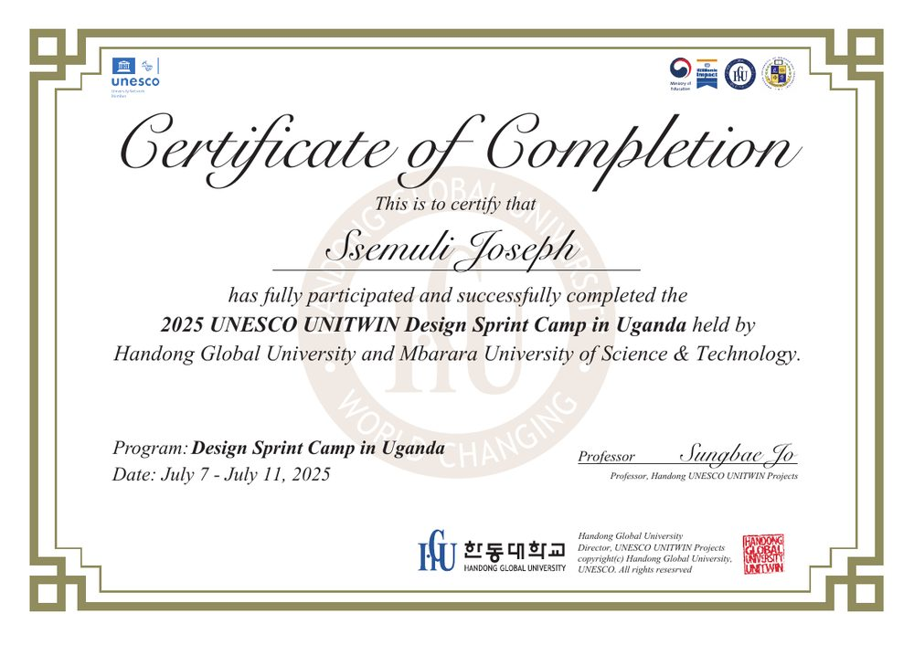
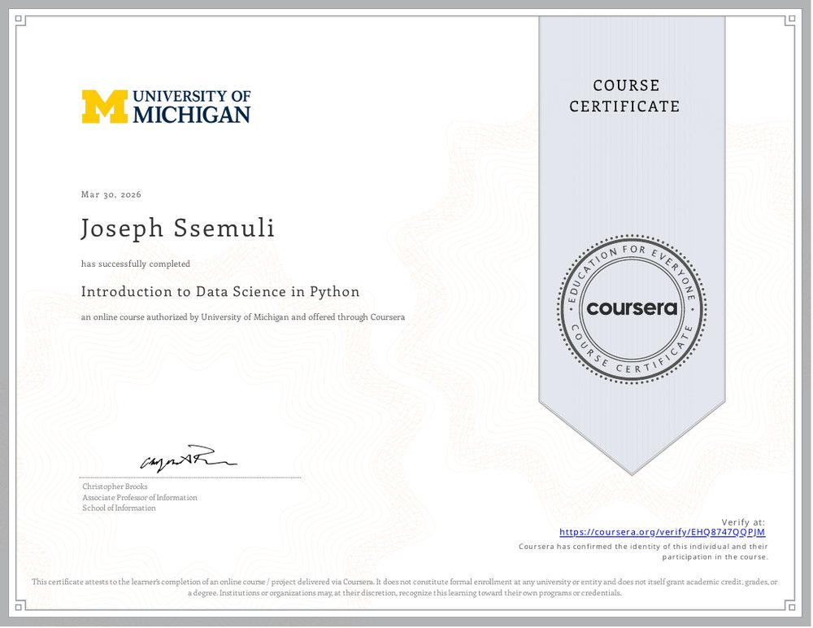
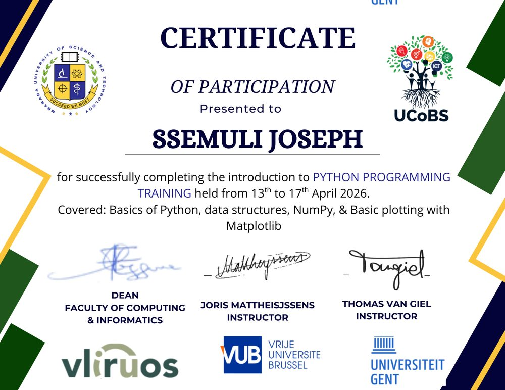
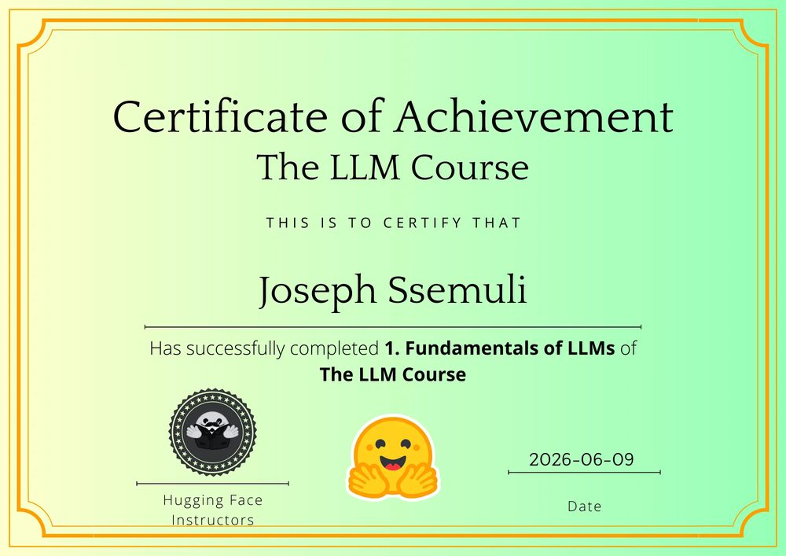
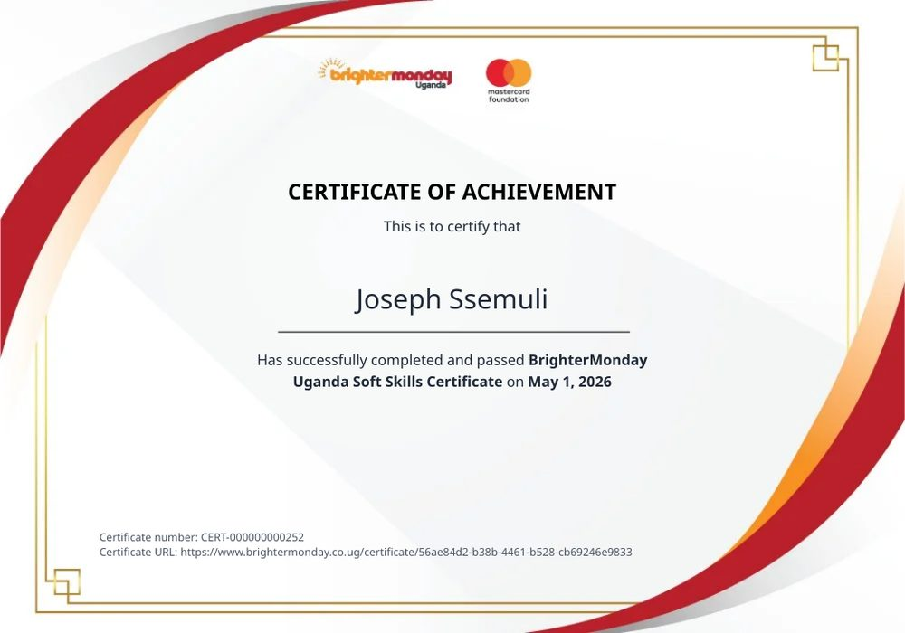
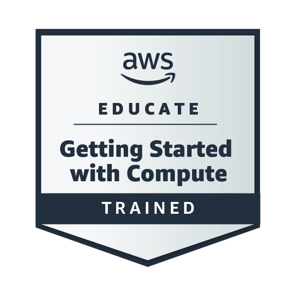

<div align="center">


<br/>


</div>

<br/>

## 🧠 About Me

I'm a Computer Science undergraduate at **Mbarara University of Science and Technology (MUST)** and an **AI/NLP Industrial Trainee at [Sunbird AI](https://sunbird.ai)**, a non-profit research lab building language technology for African and underserved languages.

I care about bridging the digital divide in East Africa — my work sits at the intersection of **NLP, LLM fine-tuning, and speech recognition**, applied to Ugandan and African local languages. I combine "Mind and Hand" 🛠️ — architecting systems across Python, Java, and PHP — to turn research into tools people actually use.

```python
class Joseph:
    def __init__(self):
        self.role = "AI/NLP Engineer & Full-Stack Developer"
        self.focus = "Language technology for African languages"
        self.currently_at = "Sunbird AI (Kampala, Uganda)"
        self.studying = "BSc Computer Science @ MUST"
        self.languages_i_speak_to_computers_in = ["Python", "Java", "PHP", "JavaScript", "C"]
        self.languages_i_build_ai_for = ["Luganda", "Lingala", "Shona", "and more 🌍"]
        self.currently_learning = "Reinforcement learning for LLMs (GRPO)"
        self.fun_fact = "⚽ Loves soccer as much as clean code"

    def collaborate(self):
        return "Always open to AI-for-good & NLP projects 🤝"
```

<br/>

## 🚀 What I'm Building Right Now

<table>
<tr>
<td width="50%" valign="top">

### 🌻 Sunflower AI Evaluation Pipeline
An **LLM-as-judge, release-gating evaluation framework** for Sunbird AI's models — designed end-to-end from architecture and scoring logic to a formal Project Plan and IEEE‑830 SRS, with diagrams generated via Graphviz & Matplotlib.

`LLM-as-a-Judge` `Evaluation` `MLOps`

</td>
<td width="50%" valign="top">

### 🎙️ Google WAXAL ASR Challenge (Zindi)
Fine-tuning **Whisper-small** jointly across Lingala, Shona & Luganda for multilingual African speech recognition — including a custom `<|lug|>` token and a lazy-collator architecture built to survive free-tier Colab.

`Speech Recognition` `Whisper` `Multilingual`

</td>
</tr>
</table>

<br/>

## 💎 Featured Projects

<table>
<tr>
<td width="33%" valign="top">

**🩺 Healthcare No-Show Predictor**
ML model in Python & Scikit-learn predicting patient no-shows to cut hospital resource waste.

`Python` `Scikit-learn` `Pandas`

</td>
<td width="33%" valign="top">

**🚆 Train Reservation System**
Java booking engine with automated seat allocation and real-time transaction processing.

`Java` `OOP`

</td>
<td width="33%" valign="top">

**💼 Career-Hub**
Full-stack job-matching platform with secure auth, connecting talent to local opportunities.

`PHP` `MySQL`

</td>
</tr>
<tr>
<td width="33%" valign="top">

**✅ Task-Flow**
Real-time productivity suite with dynamic state management for personal workflow.

`JavaScript` `CSS3`

</td>
<td width="33%" valign="top">

**🥔 PotatoGuard**
Serverless potato-disease detector — MobileNetV2 CNN at ~98% validation accuracy, deployed on AWS SageMaker.

`AWS` `CNN` `Computer Vision`

</td>
<td width="33%" valign="top">

**🗣️ Luganda Translator**
NLLB-200 + QLoRA-tuned Qwen2.5 translation pipeline, deployed as a live Gradio demo on Hugging Face.

`NLLB` `QLoRA` `Gradio`

</td>
</tr>
</table>

<p align="center">
<a href="https://huggingface.co/SsemuliJoseph"></a>
</p>

<!-- 🔧 TIP: these are GitHub repo "pin" cards — check that each repo/owner name below exactly matches your real repos, then swap in your own where the owner isn't you. -->
<p align="center">
<a href="https://github.com/MrXeskevin/Sunflower-Translator"></a>
<a href="https://github.com/MrXeskevin/Citizen-Voice-Sentiment-Tracker"></a>
</p>

<br/>

## 🛠️ Tech Stack

<div align="center">


<br/><br/>


</div>

<br/>

## 📊 GitHub Stats

<div align="center">


</div>

<br/>

## 📜 Certificates

<div align="center">
<table>
<tr>
<td align="center" width="33%">
<a href="assets/certificates/unesco-unitwin.jpg"></a>
<br/><b>UNESCO UNITWIN Design Sprint Camp</b><br/>
<sub>Handong Global University × MUST · 2025</sub>
</td>
<td align="center" width="33%">
<a href="assets/certificates/coursera-datascience.jpg"></a>
<br/><b>Introduction to Data Science in Python</b><br/>
<sub>University of Michigan · Coursera · 2026</sub><br/>
<a href="https://coursera.org/verify/EHQ8747QQPJM"></a>
</td>
<td align="center" width="33%">
<a href="assets/certificates/ghent-python-training.jpg"></a>
<br/><b>Python Programming Training</b><br/>
<sub>Ghent University × VUB × UCoBS · 2026</sub>
</td>
</tr>
<tr>
<td align="center" width="33%">
<a href="assets/certificates/huggingface-llm-course.jpg"></a>
<br/><b>Fundamentals of LLMs</b><br/>
<sub>Hugging Face LLM Course · 2026</sub>
</td>
<td align="center" width="33%">
<a href="assets/certificates/brightermonday-softskills.jpg"></a>
<br/><b>Soft Skills Certificate</b><br/>
<sub>BrighterMonday Uganda · 2026</sub><br/>
<a href="https://www.brightermonday.co.ug/certificate/56ae84d2-b38b-4461-b528-cb69246e9833"></a>
</td>
<td align="center" width="33%">

<br/><b>Getting Started with Compute</b><br/>
<sub>AWS Educate · Trained</sub>
</td>
</tr>
<tr>
<td align="center" width="33%">

<br/><b>Getting Started with Storage</b><br/>
<sub>AWS Educate · Trained</sub>
</td>
<td align="center" width="33%">
<sub>🧑‍💻 <b>Google Developers Community MUST</b><br/>hackathons & Dev-Fest Mbarara</sub>
</td>
<td width="33%"></td>
</tr>
</table>
</div>

<sub>Click any certificate to view it full-size.</sub>

<br/>

## 🤝 Let's Connect

<div align="center">

<a href="mailto:2024bcs152@std.must.ac.ug"></a>
<a href="https://www.linkedin.com/in/joseph-ssemuli-955048344"></a>
<a href="https://huggingface.co/SsemuliJoseph"></a>
<a href="https://wa.me/256783060085"></a>

</div>

<br/>

<div align="center">

*"Solving local challenges with global-standard technology."* ⚡

<picture>
  <source media="(prefers-color-scheme: dark)" srcset="https://raw.githubusercontent.com/SsemuliJoseph/SsemuliJoseph/output/github-contribution-grid-snake-dark.svg" />
  <source media="(prefers-color-scheme: light)" srcset="https://raw.githubusercontent.com/SsemuliJoseph/SsemuliJoseph/output/github-contribution-grid-snake.svg" />
  
</picture>

</div>
